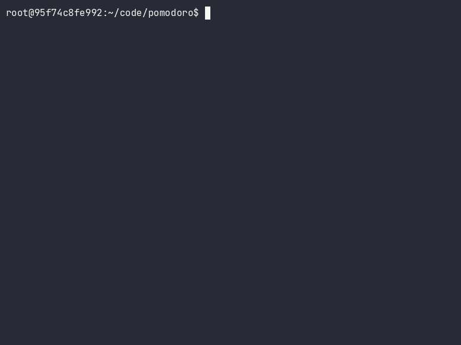

# Pomodoro



## Help

```bash
$ ./pomodoro --help
Usage of ./pomodoro:
  -long int
        Long break duration in seconds (default 900)
  -pomodoro int
        Pomodoro duration in seconds (default 1500)
  -short int
        Short break duration in seconds (default 300)
```

## Keybindings

| Key | Action |
| --- | --- |
| `Space` | Start, pause, or resume the selected timer |
| `r` | Reset the current timer |
| `Right`, `d`, `Tab` | Move to the next tab |
| `Left`, `a` | Move to the previous tab |
| `q`, `Ctrl+C` | Quit |

## Download

Get the latest release from [GitHub Releases](https://github.com/bartosz121/pomodoro/releases)
